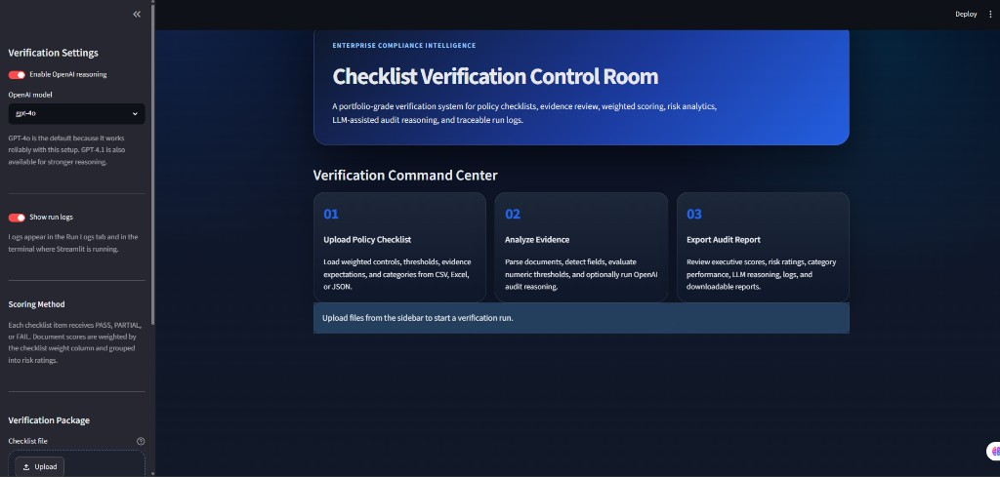
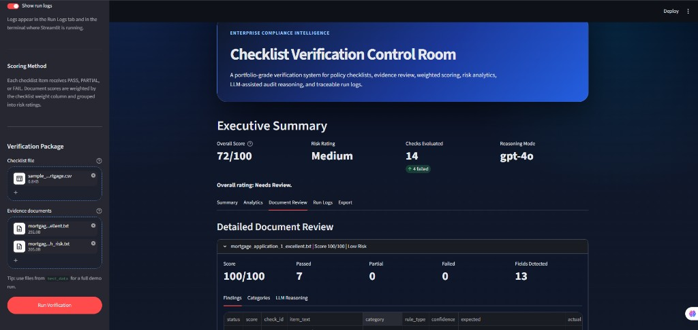
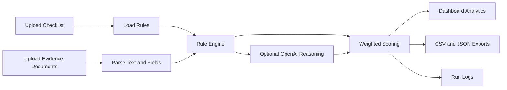

# Checklist Verification Control Room


A compliance verification system for validating policy checklists against supporting evidence documents. The app parses uploaded documents, applies structured checklist rules, calculates weighted compliance scores, optionally adds OpenAI-based audit reasoning, and exports traceable reports with run logs.

## 📸 Screenshots

### Dashboard Home



### Verification Results



## 🔎 Overview

Checklist Verification Control Room helps reviewers answer one core question:

> Does this evidence package satisfy the required checklist controls?

The system supports:

- ✅ Rule-based verification for deterministic checks
- 📊 Weighted scoring by checklist item importance
- 🟢 PASS, 🟡 PARTIAL, and 🔴 FAIL outcomes
- 🧭 Category-level analytics for KYC, eligibility, risk, documentation, and more
- 🤖 Optional OpenAI reasoning for audit-style explanations
- 🧾 Run logs shown in the frontend and terminal
- 📦 Downloadable CSV, JSON, and log exports
- 🧪 Test data for quick demos

## ✨ Key Features

### 🖥️ Streamlit Dashboard

- Dark interface
- Sidebar-based verification package upload
- Executive summary metrics
- Document scorecards
- Category score charts
- Outcome distribution charts
- Detailed document review
- LLM reasoning table
- Run logs tab
- Export center

### ⚙️ Rule Engine

The rule engine supports:

- `boolean`: checks whether a required field or keyword exists
- `threshold`: compares numeric document fields against checklist rules
- `semantic_match`: compares two parsed fields with similarity scoring

Each rule returns:

- Status: `PASS`, `PARTIAL`, or `FAIL`
- Numeric score
- Confidence
- Expected value
- Actual value
- Explanation
- Reason code
- Optional LLM reasoning fields

### 🤖 OpenAI Reasoning

When enabled, the app sends checklist rules and document excerpts to OpenAI for audit-style reasoning. The default model is `gpt-4o`, with `gpt-4.1` and `gpt-4o-mini` also available.

The LLM returns structured JSON:

- `outcome`
- `confidence`
- `explanation`
- `evidence`
- `missing_info`
- `recommendation`

If OpenAI fails or model access is unavailable, the system does not force the compliance score to zero. It falls back to the rule-based score and records the LLM error in logs and exports.

### 🧾 Traceable Logs

Logs are displayed in:

- The Streamlit terminal
- The app's Run Logs tab
- Downloadable `run_log.txt`
- The exported JSON report

Logged events include:

- Checklist loading
- Document parsing
- Parsed field keys
- Rule evaluation results
- LLM request status
- LLM errors and retries
- Per-document scores
- Overall score and risk rating

## 📁 Project Structure

```text
.
├── app_logging.py              # Shared logging setup for terminal and UI logs
├── crewai_orchestrator.py      # OpenAI reasoning layer
├── parser.py                   # Checklist and document parsing
├── rule_engine.py              # Deterministic rule evaluation
├── streamlit_app.py            # Main Streamlit dashboard
├── verifier.py                 # Verification orchestration and report generation
├── requirements.txt            # Python dependencies
├── test_data/
│   ├── sample_checklist_mortgage.csv
│   ├── mortgage_application_1_excellent.txt
│   ├── mortgage_application_2_high_risk.txt
│   ├── mortgage_application_3_strong.txt
│   ├── mortgage_application_4_needs_review.txt
│   └── mortgage_application_5_critical.txt
└── README.md
```

## 🧠 How It Works



## 📊 Scoring Model

Each checklist item produces a score:

- `PASS`: 100
- `PARTIAL`: 50
- `FAIL`: 0

Document score:

```text
weighted_score = sum(item_score * item_weight) / sum(item_weight)
```

Risk ratings:

| Score Range | Rating |
| --- | --- |
| 90-100 | Excellent |
| 80-89 | Strong |
| 65-79 | Needs Review |
| 50-64 | High Risk |
| 0-49 | Critical |

## 🚀 Getting Started

### 1. Clone the repository

```bash
git clone https://github.com/thisisahmad/checlist-verification.git
cd checlist-verification
```

### 2. Create a virtual environment

```bash
python -m venv .venv
```

Windows PowerShell:

```powershell
.\.venv\Scripts\Activate.ps1
```

macOS/Linux:

```bash
source .venv/bin/activate
```

### 3. Install dependencies

```bash
pip install -r requirements.txt
```

### 4. Install the spaCy model

```bash
python -m spacy download en_core_web_sm
```

### 5. Optional: configure OpenAI

Create a local `.env` file:

```env
OPENAI_API_KEY=your_openai_api_key_here
```

Do not commit `.env` to GitHub. It is ignored by `.gitignore`.

### 6. Run the app

```bash
python -m streamlit run streamlit_app.py
```

Open the local URL shown in the terminal, usually:

```text
http://localhost:8501
```

## 🧪 Demo Workflow

Use the included test data:

1. Open the app.
2. Upload `test_data/sample_checklist_mortgage.csv` as the checklist.
3. Upload one or more `test_data/mortgage_application_*.txt` files as evidence.
4. Click `Run Verification`.
5. Review:
   - Executive Summary
   - Summary tab
   - Analytics tab
   - Document Review tab
   - Run Logs tab
   - Export tab

Expected sample behavior:

| Document | Expected Result |
| --- | --- |
| `mortgage_application_1_excellent.txt` | Excellent |
| `mortgage_application_2_high_risk.txt` | Critical / High risk |
| `mortgage_application_3_strong.txt` | Excellent |
| `mortgage_application_4_needs_review.txt` | Needs Review |
| `mortgage_application_5_critical.txt` | Critical |

## 📋 Checklist Format

Example CSV:

```csv
id,item_text,category,weight,rule_type,rule_spec,confidence_threshold
ITEM-001,Applicant full name present,KYC,1,boolean,"{""keyword"": ""Applicant Name""}",0.75
ITEM-002,Applicant age must be >= 21,Eligibility,1,threshold,"{""field"": ""age"", ""operator"": "">="", ""value"": 21}",0.9
ITEM-003,Monthly income must be >= 4000,Eligibility,1,threshold,"{""field"": ""monthly_income"", ""operator"": "">="", ""value"": 4000}",0.85
```

Required / supported columns:

| Column | Purpose |
| --- | --- |
| `id` | Unique checklist item ID |
| `item_text` | Human-readable requirement |
| `category` | Reporting group |
| `weight` | Scoring weight |
| `rule_type` | `boolean`, `threshold`, or `semantic_match` |
| `rule_spec` | JSON rule definition |
| `confidence_threshold` | Minimum confidence for full pass |

## 📄 Evidence Document Format

Text files work best when fields use `Key: Value` lines:

```text
Applicant Name: John A. Doe
Age: 29
Monthly Income: 5000
Employment Status: Full-time
Property Address: 123 Main St
ID Number: AB1234567
LTV: 0.80
```

The parser normalizes field names:

```text
Monthly Income -> monthly_income
ID Number -> id_number
```

## 🔍 PDF and OCR Support

The parser can extract text from PDFs using `pdfplumber`. If a PDF has little extractable text, it can attempt OCR with `pdf2image` and `pytesseract`.

For OCR on Windows, you may also need:

- Tesseract OCR installed and available on PATH
- Poppler installed for `pdf2image`

TXT files do not require OCR dependencies.

## 📦 Exported Reports

The app can export:

- Per-document CSV findings
- Per-document JSON report
- Complete JSON audit package
- Run log text file

The complete JSON includes:

- Overall score
- Overall risk
- LLM model
- LLM error count
- Run log
- Document-level scores
- Category scores
- Item-level findings
- LLM explanations and recommendations

## 🔐 Security Notes

This repository intentionally ignores:

- `.env`
- virtual environments
- PEM keys
- local credential files
- generated reports
- local one-off scripts that may contain secrets

Never commit real API keys, private keys, or customer documents.

## 🛠️ Troubleshooting

### Streamlit command not found

Use:

```bash
python -m streamlit run streamlit_app.py
```

### spaCy model missing

Run:

```bash
python -m spacy download en_core_web_sm
```

### OpenAI model fails

Use `gpt-4o` from the sidebar. The app records LLM failures in logs and falls back to deterministic scoring.

### Scores look wrong

Check:

- The `rule_spec` JSON in the checklist
- The field names in evidence documents
- The Run Logs tab
- Whether the document uses `Key: Value` lines

## 🧰 Technology Stack

- 🐍 Python
- 🎈 Streamlit
- 🐼 pandas
- 🧠 spaCy
- 📄 pdfplumber
- 🔎 pytesseract
- 🤖 OpenAI Python SDK
- 📐 scikit-learn / fuzzy matching utilities

## 🔗 Repository

GitHub: [thisisahmad/checlist-verification](https://github.com/thisisahmad/checlist-verification)

